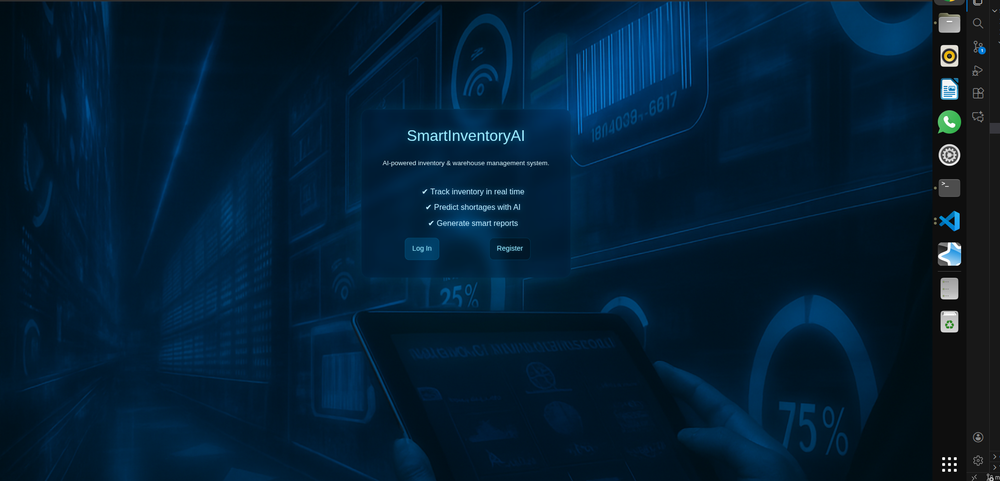
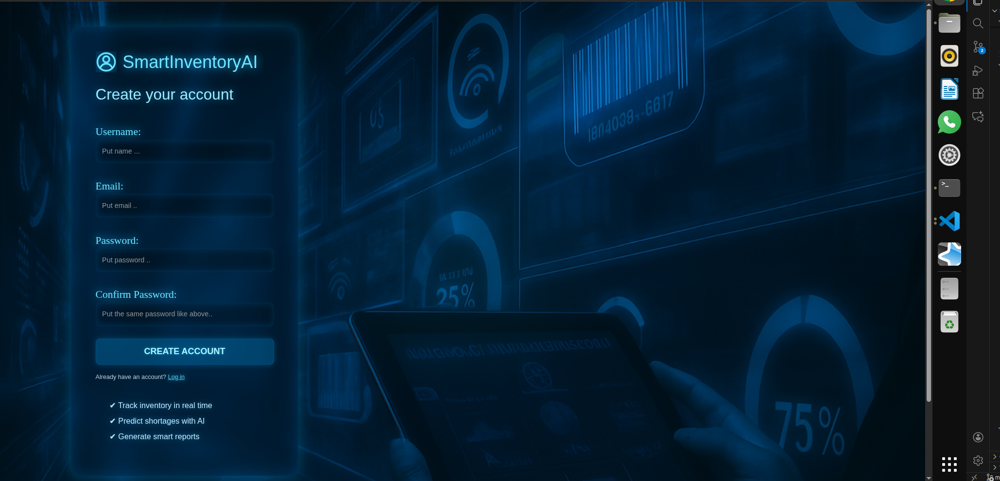
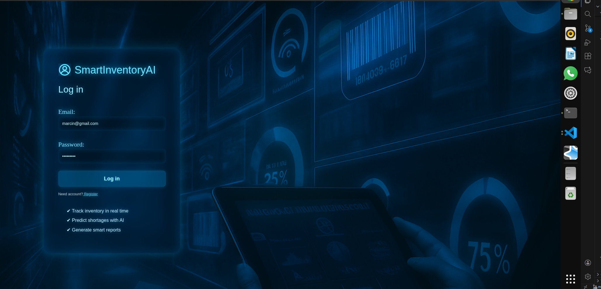
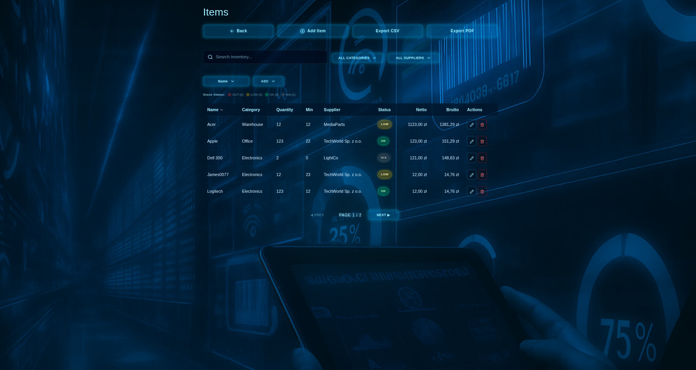

# SmartInventoryAI 📦🤖

**SmartInventoryAI** is a fullstack inventory management system built with Node.js, Express, PostgreSQL, and React.
The project focuses on backend-driven architecture, secure authentication, and a clean frontend client consuming a REST API.

---

## ✨ Features

- Real-time inventory management
- Advanced filtering, sorting, and pagination
- AI-ready architecture for stock predictions
- Secure authentication (Register / Login)
- CSV and PDF export
- Modern, neon-inspired UI
- Fully responsive layout

---

## 🖥️ Backend Architecture

The backend is built with Node.js, Express, and PostgreSQL.

Key backend features:

- RESTful API architecture
- JWT-based authentication
- Role-ready authorization layer
- Server-side pagination, filtering, and sorting
- Input validation and error handling
- PostgreSQL relational data modeling

## 🖼️ Screenshots

> Screenshots are stored inside the `screenshots/` directory.

### Landing Page



### Register Page



### Login Page



### Items Module



---

## 🧱 Tech Stack

### Frontend

- React
- React Router
- Axios
- Context API (authentication)
- Custom reusable UI components

### Backend (via REST API)

- JWT authentication
- Server-side pagination and filtering
- Secure credential handling

---

## 🔐 Authentication

- User registration with form validation
- Secure login using JWT access tokens
- Authentication state stored in Context and localStorage
- Protected routes for authenticated users

---

## 📦 Items Module

The **Items module** handles inventory management with support for filtering, sorting, pagination, and CRUD operations.

### Key Features

- URL-driven filters and pagination
- Column-based sorting with ascending / descending order
- Visual stock status filtering with live counters
- Server-side pagination
- CSV and PDF export
- Add, edit, and delete items via modal dialogs

---

### Architecture Overview

The module follows a clear separation of concerns:

- **`Items.jsx`**  
  Page-level component responsible for:
  - synchronizing filters, sorting, and pagination with the URL
  - triggering data fetching
  - managing add/edit modal state

- **`ItemsList.jsx`**  
  Presentational container responsible for rendering:
  - filters and stock legend
  - sortable items table
  - pagination controls

- **UI Components**  
  (`FiltersBar`, `StockLegend`, `StockBadge`)  
  Stateless components focused on presentation and interaction.

- **Custom Hooks**
  - `useFetchItems` – data fetching and pagination logic
  - `useItemActions` – add, edit, and delete operations
  - `useExportItems` – CSV and PDF export logic

---

### Filtering, Sorting, and Pagination

Filtering, sorting, and pagination state is stored in the URL using `useSearchParams`.

Rules:

- changing filters or sorting resets the page to `1`
- pagination does not reset active filters
- the view is shareable and refresh-safe

Stock filtering is handled through a visual legend instead of a dropdown to improve usability.

---

### UX Considerations

- clear visual stock indicators
- live counters per stock status
- predictable pagination behavior
- explicit action buttons per row
- URL always reflects the current state

---

## 📁 Project Structure (simplified)

src/
├── components/
│ ├── layout/
│ ├── ui/
│ ├── form/
│ └── icons/
├── pages/
│ ├── StartPage.jsx
│ ├── Register.jsx
│ ├── Login.jsx
│ └── Items.jsx
├── hooks/
├── config/
└── App.jsx

---

## 🚀 Getting Started

### 1. Clone the repository

```bash
git clone https://github.com/MarcinProgramista/smartinventoryai.git
cd smartinventoryai
```

2. Install dependencies
   npm install

3. Run the app
   npm start

The application will be available at:
http://localhost:5173/

🎯 Project Goals

Build a production-ready fullstack application

Design a robust Node.js backend with PostgreSQL

Expose a secure REST API consumed by a React client

Practice backend-first architecture and API-driven frontend development

🛣️ Roadmap

Dashboard analytics view

User roles (Admin / User)

Refresh token handling

AI-powered demand prediction

Deployment (Docker / Cloud)

👨‍💻 Author
Marcin Czapla
